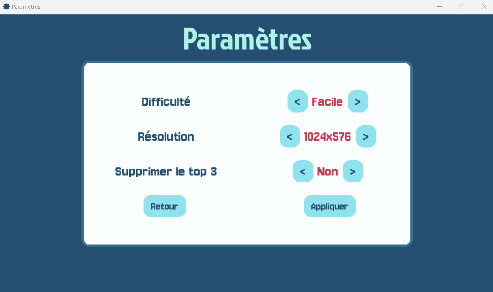

# minesweeper file documentation


---

🎮 Game Menu System 🎮

---

📌 **Project Description**

A customizable game menu system built with **Pygame**. This project provides an interactive interface for setting game preferences, including **difficulty, resolution, and erase record selection**, as well as a **winner screen**.

# Minesweeper game with Python

**Features**

- 🎛  **Settings Menu**: Adjust difficulty, resolution, and erase top 3 players.  
- 🏆 **Winner Screen**: Displays victory messages and prompts for player name entry.  
- 🎨 **Customizable UI**: Uses various fonts, colors, and buttons.  
- 🔄 **Dynamic Navigation**: Clickable buttons and arrow-based selection.  

---

## Technologies Used

- **Python** : Main Programming Language.
- **Pygame** : Library for creating games and multimedia applications..

## Prerequisites

Before running this project, you need to install the following libraries and tools:

1. **Python 3.x**
2. **The following Python libraries:** :
   - `pygame`


You can install the necessary libraries using: `pip` :

```bash
pip install pygame
```

---

## Installation

1.  Clone this project to your local machine.
    ```bash
    git clone https://github.com/AdelinePat/minesweeper.git
    ```
2.  Access the project directory:

    ```bash
    git cd minesweeper
    ```

3.  Make sure pygame is installed on your machine.

4.  Create the `.env ` file to install the libraries

---

## Usage

1.  Running the Application:

```bash
python main.py
```

2.  You will be prompted to log in with your credentials or create an account if you don't have one.

3.  After logging in, you will be able to make transactions, view the transaction history, and check your finances..

## File Structure

📂 assets  
│ 📂 font  
│ 📂 icon  
│ 📂 img   
  
📂 controller  
│ 📄 menu_controller.py  

📂 model  
│ 📄 date_access.py  
│ 📄 game_grid.py  
│ 📄 game_info.py  
│ 📄 square.py  
  
📂 view  
│ 📄 __settings__.py  
│ 📄 in_game_menu.py  
│ 📄 interface.py  
│ 📄 main_menu.py   
│ 📄 menu.py  
│ 📄 roll_of_fame.py  
│ 📄 settings_menu.py  
│ 📄 victory_menu.py   
  
📄 .gitignore  
📄 main.py  
📄 README.md  
  
  
---


# Contributing

This project was made by:

- [Eltigani Abdallah](https://github.com/eltigani-abdallah)
- [Adeline Patenne](https://github.com/AdelinePat/)
- [Florence Navet](https://github.com/florence-navet)
- [Yulia Sherstiuk](https://github.com/yuliia-sherstiuk)

### Licence

This project is licensed under the MIT License.

---

  


